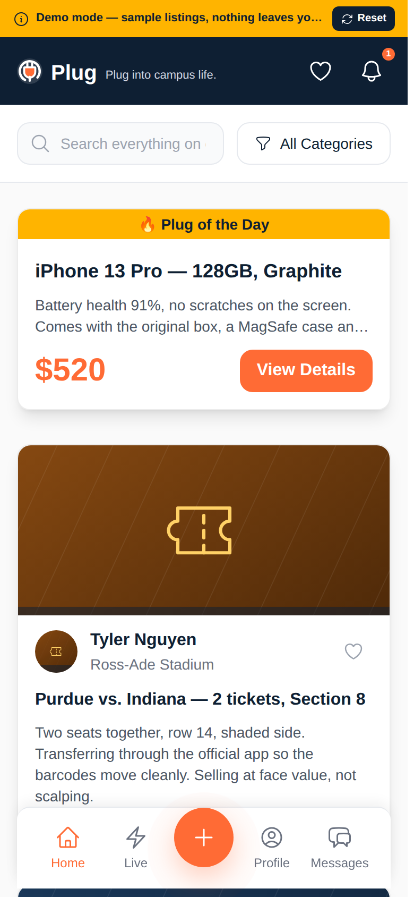
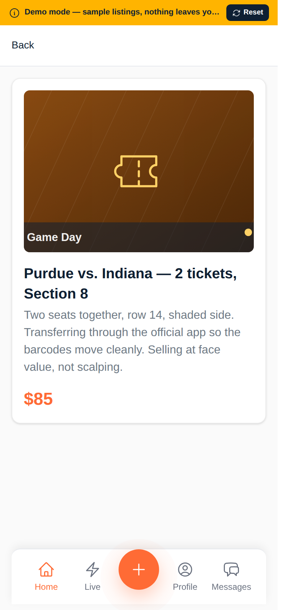
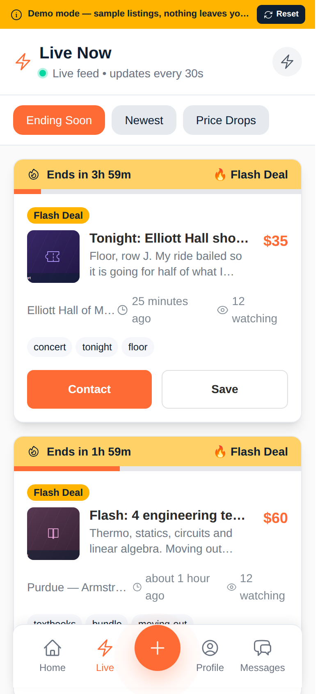
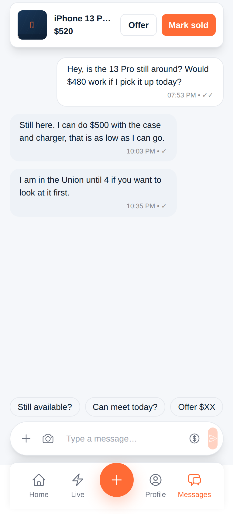
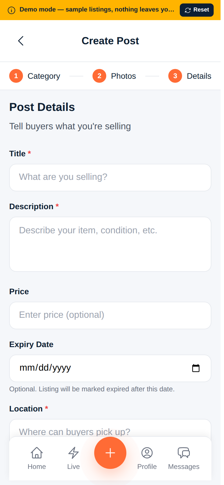

# Plug — campus marketplace

**Live demo: https://plug-yougijain.vercel.app** — no account needed, click *Explore the demo*.

A mobile-first marketplace where verified students buy and sell textbooks, tickets, furniture,
sublets and rides with people on their own campus. Built with React 18 + TypeScript on a
Supabase (Postgres) backend, and shipped with a self-contained demo backend so the public link
works without a database behind it.

<p align="center">
  
  
  
  
  
</p>

## What it does

- **Campus feed** — active listings scoped to the student's university, with search and category filters, seller attribution, tags and a data-driven "Plug of the Day" highlight.
- **Live tab** — flash deals with an expiry (15/30/60 min) that surface separately from the main feed and drop off when they lapse.
- **Listing composer** — three-step flow (category → photos → details) with client-side image previews, price normalisation and an optional expiry date.
- **Messages** — one thread per listing between buyer and seller, with the listing pinned at the top of the conversation.
- **Saved & cart** — heart a listing to keep it, with a lightweight checkout-style cart.
- **Profile** — a student's own active and sold listings.
- **Auth** — email/password sign-up restricted to supported campuses, with email confirmation gating access (Supabase Auth).

## How the live demo works

The app talks to its backend only through four objects in [`src/lib/api.ts`](src/lib/api.ts) —
`userApi`, `postsApi`, `messagesApi`, `ridesApi` — plus `auth` and `storage` in
[`src/lib/supabase.ts`](src/lib/supabase.ts). Each has two implementations:

| | Supabase backend | Demo backend ([`src/lib/demo/`](src/lib/demo)) |
|---|---|---|
| Selected when | `REACT_APP_SUPABASE_URL` + `REACT_APP_SUPABASE_ANON_KEY` are set | those are absent, or `REACT_APP_DEMO_MODE=true` |
| Data | Postgres via PostgREST, RLS policies, Supabase Storage for photos | Seeded dataset ([`seed.ts`](src/lib/demo/seed.ts)) persisted in `localStorage`, photos downscaled to data URLs |
| Auth | Supabase Auth with email confirmation | One-click demo identity; any `.edu` address also signs in |

[`src/lib/env.ts`](src/lib/env.ts) makes the choice once at startup, so pages, hooks and React
Query caches are identical in both modes. The demo backend adds a little simulated latency so
loading and skeleton states get exercised, and the yellow banner's **Reset** restores the seed.

This is what keeps the link above working for anyone, any time — there is no database to cold-start
and no sign-up wall — while the same build, pointed at a Supabase project, runs on Postgres.

## Stack

- **UI**: React 18, TypeScript, React Router 6, Tailwind CSS, Framer Motion, Heroicons
- **State/data**: TanStack Query (server state, optimistic listing creation), Zustand (session, saved items, cart), React Hook Form + Zod (forms)
- **Backend**: Supabase — Postgres, Auth, Storage, Row Level Security ([schema](create-complete-schema.sql), [reference](DATABASE_SCHEMA_REFERENCE.md))
- **Tooling**: Create React App, Jest + Testing Library, Playwright, Vercel

## Project layout

```
src/
├── App.tsx                # routing, auth gate, desktop frame
├── pages/                 # Home, LiveNow, Post, PostDetail, Messages, Profile, Saved, Cart, Login
├── components/            # Navigation, DemoNotice, DesktopFrame, SVGIcon, ...
├── hooks/                 # useAuth, usePosts, useMessages, useUsers (React Query wrappers)
├── lib/
│   ├── api.ts             # data-access interfaces; picks Supabase or demo at startup
│   ├── supabase.ts        # client + auth/storage adapters
│   ├── env.ts             # backend selection
│   ├── demo/              # seed data, persistence, demo implementations
│   ├── store.ts           # Zustand store
│   └── queryClient.ts
└── types/                 # app types and generated-style Database types
tests/e2e/                 # Playwright specs
```

## Running locally

```bash
npm install
npm start            # http://localhost:3000, demo backend
```

To run against Supabase instead, create a project, run
[`create-complete-schema.sql`](create-complete-schema.sql) in the SQL editor, and copy
[`.env.example`](.env.example) to `.env` with your project URL and anon key. Photos expect a public
storage bucket named `post-images`.

## Tests

```bash
npm test                        # Jest unit tests (composer price formatting, optimistic cache)
npm run e2e                     # Playwright, boots the dev server
E2E_BASE_URL=https://plug-yougijain.vercel.app npm run e2e   # same specs against the deployment
```

[`tests/e2e/demo-mode.spec.ts`](tests/e2e/demo-mode.spec.ts) walks the demo path end to end: entry
without credentials, filtering and search, deep links, the live tab, creating a listing, replying
in a thread, the 404 fallback and the reset control. The other specs exercise the Supabase flow and
skip unless `TEST_EMAIL`/`TEST_PASSWORD` are provided.

## Deployment

Deployed on Vercel from this repository. [`vercel.json`](vercel.json) adds the SPA rewrite so deep
links like `/post/:id` resolve, and long-lived caching for hashed assets. No environment variables
are set for the public deployment, which is what puts it in demo mode; setting the two Supabase
variables in the Vercel project switches the same build to Postgres.

## Known gaps

- Offers and "mark as sold" in a thread are UI only; the payment path (Venmo/Zelle/cash) is out of band by design for the MVP.
- Notifications are a placeholder badge; there is no push or realtime subscription yet.
